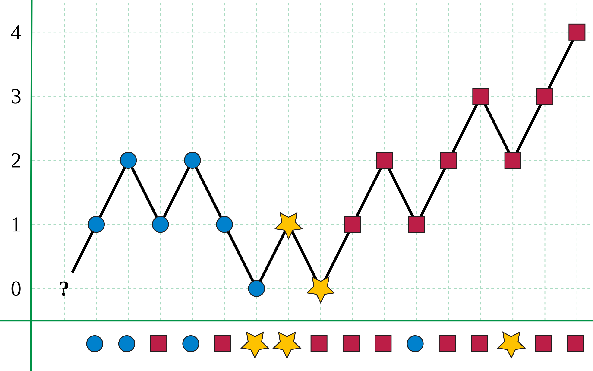

# 169. Majority Element

## Intuition

Sorting the array will make this easier, as the majority array would be in the middle. However sorting isn't an efficient strategy for this approach.

Given the array is not pre-sorted (which would trivialize the problem anyway), we can't take shortcuts and we need to traverse the entire array to ensure we find the correct element. For example:
`[2,2,1,1,1,2,2]` only at the last element can you be sure that `2` is the majority element.

My first thought was we needed to keep track of each element and how often it occured in an array of tuples. This is however not space efficient, and I later learned of the existence of the [Boyer-Moore majority voting algorithm](https://en.wikipedia.org/wiki/Boyer%E2%80%93Moore_majority_vote_algorithm), which I used. (I only needed to look at the image to understand and implement it).



The advantage of counting each element is of course that in some cases (if the number of any element is greater than `n/2`) you can return early. This might be a good approach if you value time-complexity over space complexity. I opted for space complexity instead.

## Approach

The algorithm is fairly easy to implement, as essentially it follows the following logic:

Assume the first element you see is the majority element.
Every time you encounter the same element, increment the counter by 1.
Every time you encounter an element that isn't the current element, decrease the counter by 1.

If the counter reaches 0, the next element you encounter is the majority element.

This works because every element that isn't the majority element will eventually reach 0 and be replaced by the actual majority element. The majority element will not stay at 0, because it's the majority element. However because it may take until the end of the array to correctly identify the majority element and because you are not keeping track of how many times you encountered the element, you can not exit early.

## Complexity

### Time

$$O(n)$$
We need to fully traverse the array to ensure we correctly identify the majority element.

### Space

$$O(1)$$
We are only keeping track of two values no matter the size of the input.

## Code

### Rust

```rust
impl Solution {
    pub fn majority_element(nums: Vec<i32>) -> i32 {
        // set element out of bounds to ensure it won't be in the input
        let (mut element, mut count) = (1_000_000_001, 0);
        for num in nums {
            if count == 0 {
                element = num;
                count += 1;
            } else if element == num {
                count += 1;
            } else {
                count -= 1;
            }
        }
        return element;
    }
}
```
