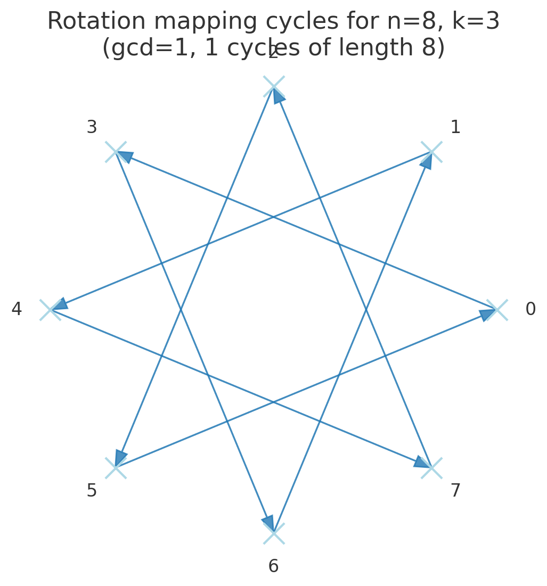

# 189. Rotate Array

## Intuition

We can think of the array like a chain, swapping out one number at a time. We only need to store one number temporarily while we keep copying the next number into position, then keep going down the chain until you rotated all the numbers.

The actual approach turned out harder than initially expected, as coming up with a way ensure you visited each element exactly once was not as trivial as I thought it would be. However, the following approach details how the solution works.

## Approach

We normalize the rotations, as rotations follow modular arithmetic. If the normalized rotations effectively are 0 or if the array is 1, no rotations are needed and we can simply exit.

Rotating by `k` is essentially

$$f(i)=(i+k)\mod n$$

example: `n=6` `k=2`

```
0 → 2
1 → 3
2 → 4
3 → 5
4 → 0
5 → 1
```

This mapping is a permutation of indices (1-to-1 and onto).
Every element moves somewhere, and no two elements land in the same place.

If you start at some index `i` and repeatedly apply `f`, you eventually return to `i`.

Example `(n=6, k=2)`:

Start at 0: 0 → 2 → 4 → 0 → …  
Cycle = `{0, 2, 4}`

Start at 1: 1 → 3 → 5 → 1 → …  
Cycle = `{1, 3, 5}`

Notice: every index belongs to exactly one such cycle.

### How do we know how many cycles there are and the length of each?

The number of distinct cycles is the greatest common divisor:
$$g=gcd(n,k)$$
Each cycle length is:
$$L=\frac ng$$

### Why?

Moving forward by `k` repeatedly is like adding `k` mod `n`.  
That is the same as walking around a circle of size `n` in steps of size `k`.

You come back to the starting point once you’ve walked a multiple of `n` steps:

$$m⋅k≡0 \mod n$$

The smallest such `m` is

$$m=\frac n {gcd(n,k)​}$$
​
So that’s the cycle length.

Since the array has `n` elements total, the number of cycles is

$$\frac nL=gcd(n,k)$$

### Indices in the same cycle have the same remainder mod g

If you look at the indices visited in one cycle, they all share the same remainder when divided by `g`.

Example: `n = 6, k = 2, g = gcd(6,2) = 2`

Cycle 1: {0, 2, 4} → all ≡ 0 mod 2

Cycle 2: {1, 3, 5} → all ≡ 1 mod 2

That’s a general rule: cycles are “grouped” by remainder modulo `g`.

These properties ensure:

- No overlaps: Cycles are disjoint; the inner loop breaks as soon as it closes the cycle; the outer loop stops after all cycles are done.
- No misses: Each cycle’s inner loop touches all indices in that cycle. Doing all `g` cycles covers all `n` indices.

Knowing all this, we create an outer loop to go over the cycles, and an inner loop to go through all the elements within that cycle.

We hold exactly one element in the temp storage while copying it from the old place to the new place, and we know a cycle is complete once `current + k % n` is the same as `start`.

See the following diagrams for a visual representation.

Here there is 1 group of 8 elements, meaning the outer loop runs once and the inner loop will run 8 times until it hits all the elements. We are then done.


In this example there are 2 groups of 3 elements each. The outer loop will run twice, and the inner loop will run 3 times for each of the outer loops. This means a total of 6 loops until all elements are visited. Note how the triangles are offset by exactly 1 because of the nature of modular arithmatic. This will be true for any set of numbers you can come up with.

## Complexity

### Time

$$O(n)$$
We will break out of the outer loop once we have moved each element exactly once.

### Space

$$O(1)$$
As the operation is done in-place, there is only a small constant overhead (the index pointers).

## Code

### Rust

```rust
impl Solution {
    pub fn rotate(nums: &mut Vec<i32>, k: i32) {
        let n = nums.len();
        let k = k as usize % n;
        if k == 0 || n < 2 {
            return;
        }

        let mut count = 0;
        let mut start = 0;

        while count < n {
            let mut current = start;
            let mut prev = nums[start];

            loop {
                let next = (current + k) % n;
                let temp = nums[next];
                nums[next] = prev;
                prev = temp;
                current = next;
                count += 1;

                if start == current {
                    break;
                }
            }

            start += 1;
        }
    }
}
```
